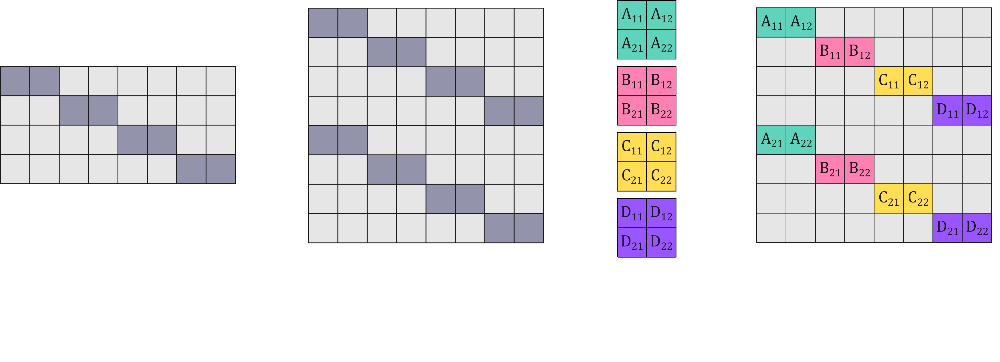

<hr>
<div align="center">

# Sparsity-Aware Orthogonal Initialization

<a href="https://pytorch.org/get-started/locally/"></a>
<a href="https://pytorchlightning.ai/"></a>
<a href="https://github.com/DeepVoltaire/AutoAugment.git"></a>


PyTorch implementation of SAO from the paper 
<a href="https://ieeexplore.ieee.org/document/10181312"> Sparsity-Aware Orthogonal Initialization of Deep Neural Networks by Esguerra et al. </a>


</div>

# Overview

Pruning is a common technique to reduce the number of parameters of a deep neural network. However, this technique can have adverse effects such as network disconnection and loss of dynamical isometry.

Thus, our solution is to leverage expander graphs (sparse yet highly-connected graphs) to form the sparse structure and then orthogonalize this structure through appropriate weight assignments.




# Installation

```bash
git clone https://github.com/kiaraesguerra/SAO
cd SAO
conda create -n myenv python=3.9
conda activate myenv
pip install -r requirements.txt
```

# Features
* Datasets: CIFAR-10, CIFAR-100, CINIC-10
* Initialization methods: kaiming-normal, delta-orthogonal initialization, explicitly-constructed orthogonal convolutions
* Pruning/Sparse construction methods: magnitude pruning, random pruning, Ramanujan pruning, SAO, Ramanujan normal, Ramanujan uniform


# Training

### 1. Delta on Vanilla CNN

```
python main.py --model cnn --num-layers 32 --hidden-width 128 --activation 'relu' --weight-init 'delta' --lr 1e-2 --min-lr 0 --scheduler 'cosine' --autoaugment True 
```

### 2. SAO-Delta on Vanilla CNN

When implementing SAO, the user can specify either the sparsity:

```
python main.py --model cnn --num-layers 32 --hidden-width 128 --activation 'relu' --pruning-method SAO --sparsity 0.5 --lr 1e-2 --min-lr 0 --scheduler 'cosine' --autoaugment True 
```

or the degree:

```
python main.py --model cnn --num-layers 32 --hidden-width 128 --activation 'relu' --pruning-method SAO --degree 4 --lr 1e-2 --min-lr 0 --scheduler 'cosine' --autoaugment True 
```

Note: When using Tanh, the minimum degree is 2. This should also be noted when specifying the sparsity, such that the sparsity should not result in a degree lower than 2, e.g., for Conv2d(16, 16), the maximum sparsity is 87.50%. For ReLU, the minimum degree is 4, where for Conv2d(16, 16), the maximum sparsity is 75.00%.

### 3. ECO on Vanilla CNN

```
python main.py --model cnn_eco --num-layers 32 --hidden-width 128 --activation 'relu' --weight-init 'delta-eco' --lr 1e-2 --min-lr 0 --scheduler 'cosine' --autoaugment True 
```

### 4. SAO-ECO on Vanilla CNN

Using sparsity:

```
python main.py --model cnn_eco --num-layers 32 --hidden-width 128 --activation 'relu' --pruning-method SAO --sparsity 0.5 --lr 1e-2 --min-lr 0 --scheduler 'cosine' --autoaugment True 
```

using degree:

```
python main.py --model cnn_eco --num-layers 32 --hidden-width 128 --activation 'relu' --pruning-method SAO --degree 4 --lr 1e-2 --min-lr 0 --scheduler 'cosine' --autoaugment True 
```


